# Creación de la Base de Datos en MySQL Workbench
#### Elaborado por Grupo 4 INF-272

## Primera Forma

1. Una vez instalada la gestión de base de datos, se visualizará en nuestro menú el `"MySQL 8.0 Command Line Client".`

2. Dentro de MySQL, aparecerá la ventana de comando del gestor de base de datos. `Ingrese la contraseña` utilizada durante la instalación.
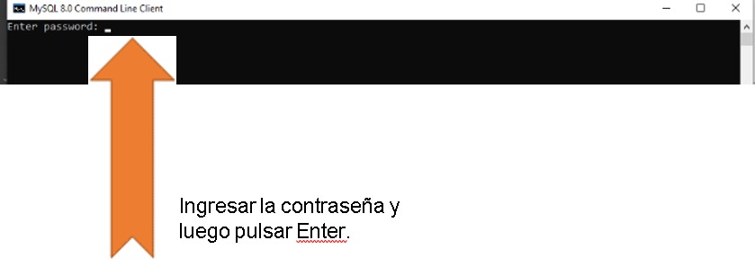
3. Ingrese el `nombre` deseado para la base de datos.
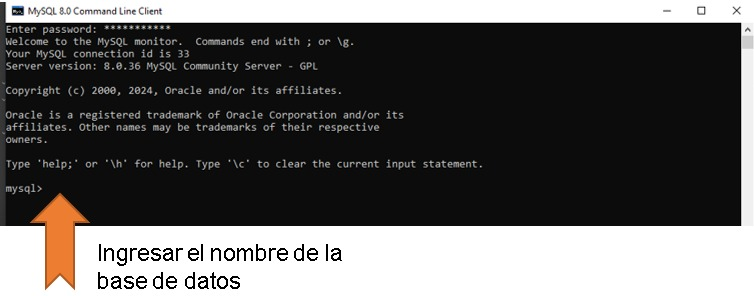
4. Utilice la siguiente sentencia para crear la base de datos: `create database nombre_basedato;`.
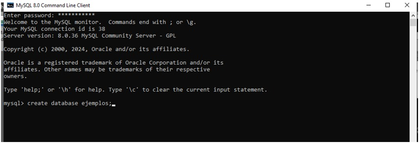
5. Una vez creada, aparecerá en el gestor de `base de datos` Workbench.
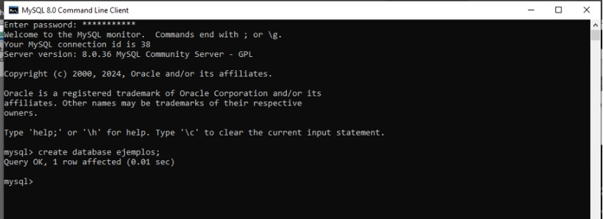
6. Ingrese a MySQL Workbench y `seleccione la conexión creada`.
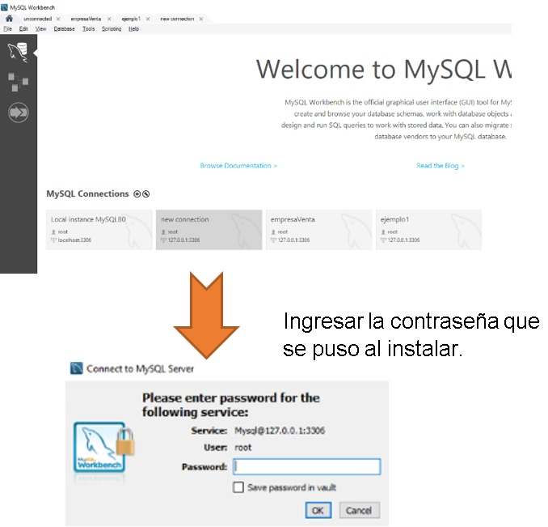
7. `Verifique que la base de datos` se haya creado satisfactoriamente.
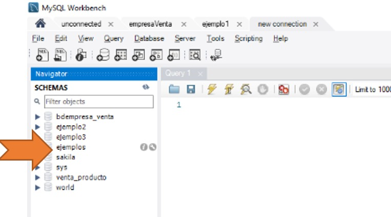

## Segunda Forma

### Creación de la Base de Datos por Comando

1. Haga clic en el icono `"+"` para agregar una nueva base de datos en las conexiones.
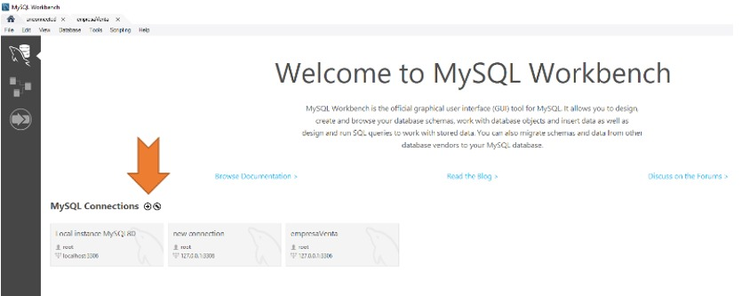
2. Ingrese el `nombre` de la base de datos.
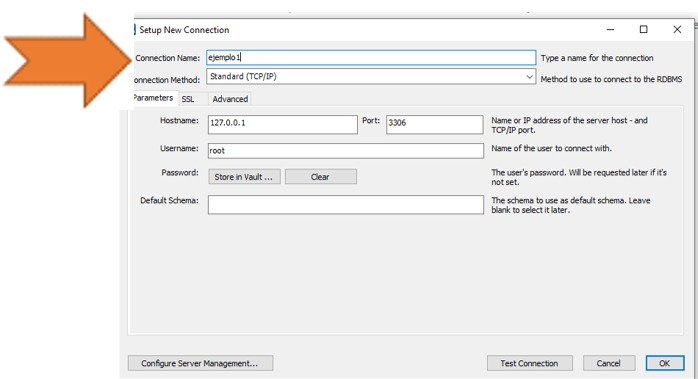
3. Ingrese la `contraseña` de instalación. La conexión estará lista.
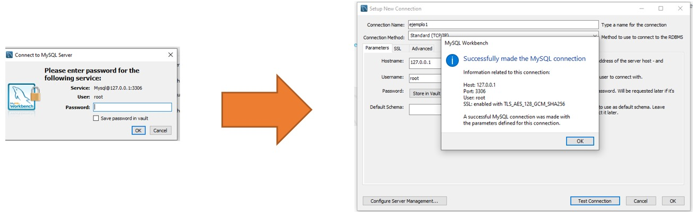
4. La `verificación` de que la base de datos fue creada aparecerá automáticamente.
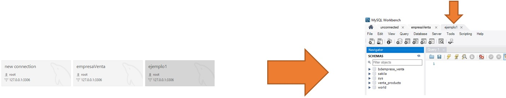
5. Utilizando una pestaña de consulta, también puede crear la base de datos con la sentencia 
`create database nombre_basededato;`. Ejecute la sentencia haciendo clic en la flecha.
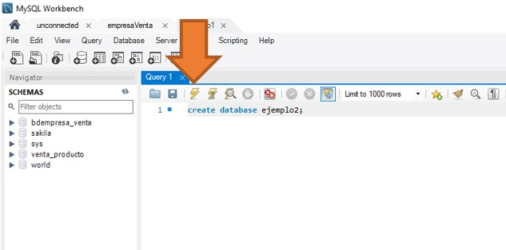
6. `Verifique` que se haya creado la base de datos de manera sencilla.
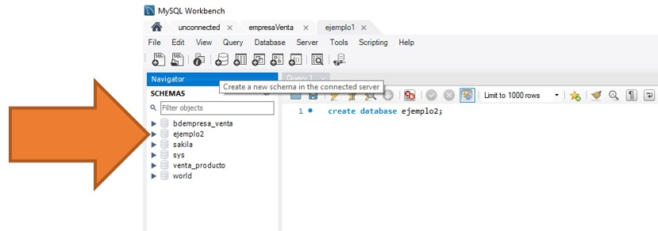
7. `Haga click` donde indica la flecha para crear la base de datos.
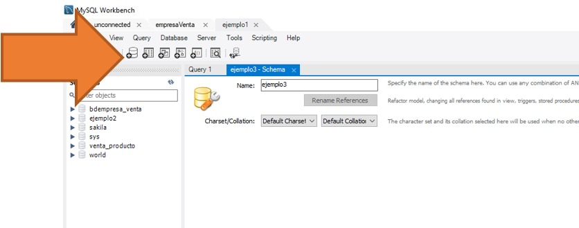
8. Ingrese el `nombre` y seleccione la opción `"utf8"` para los caracteres y "utf8_general_ci".
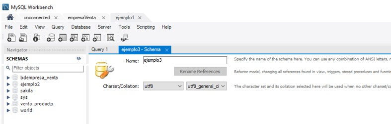
9. Aparecerá la sentencia SQL de creación. Haga clic en `"Apply"` para aplicar la creación.
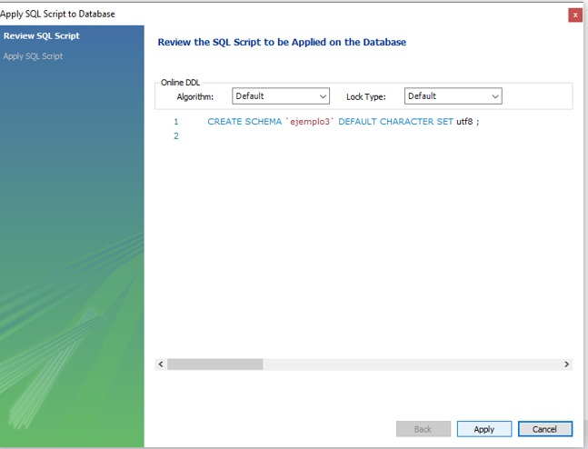
10. Haga clic en `"Finalizar"` para concluir.
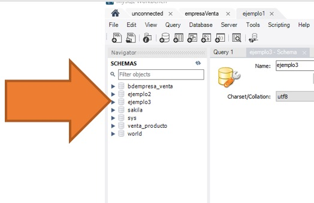

¡Importante! `Actualice` después de crear la base de datos para verificar su creación.
