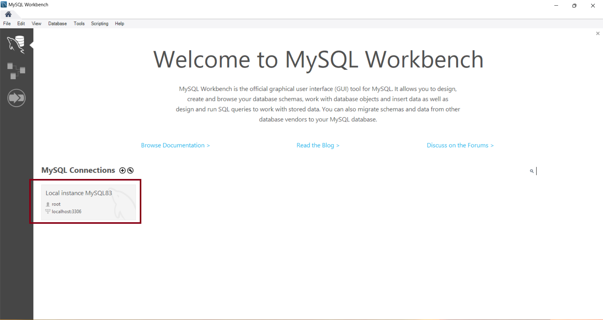
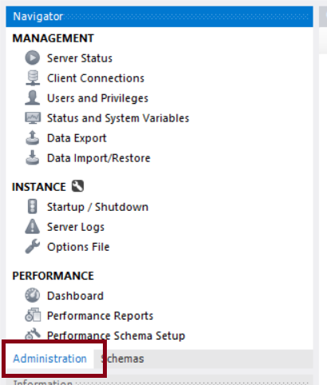
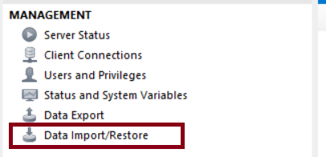
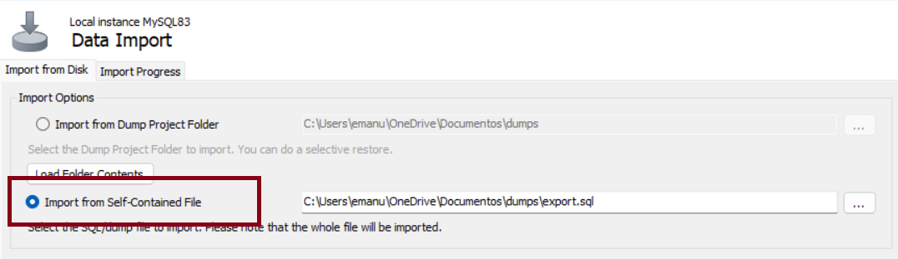
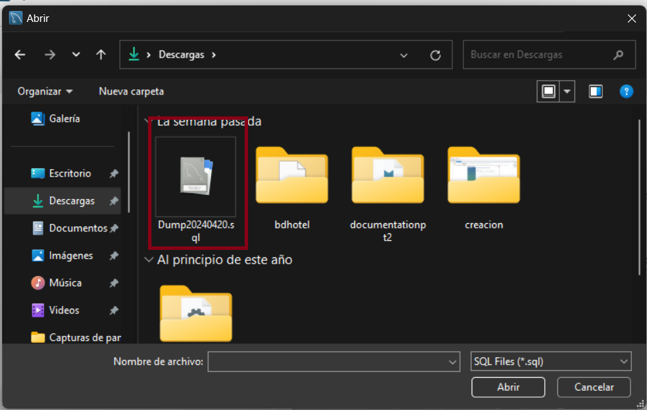
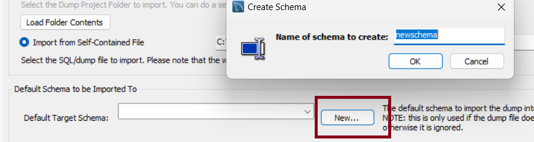
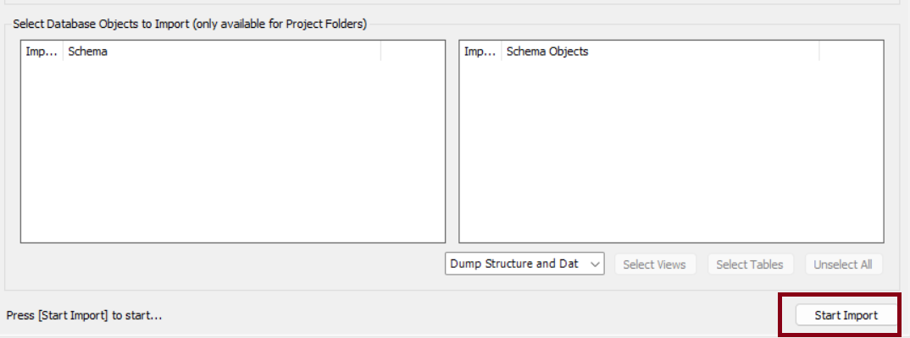
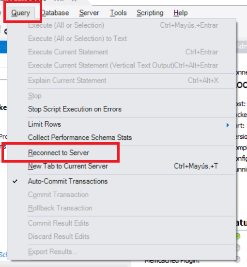
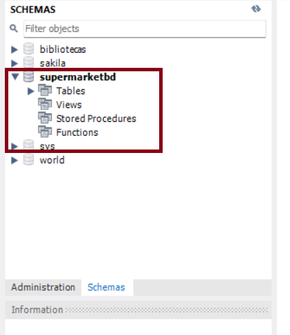

# Tutorial para la Restauración (Restore) de Bases de Datos con MySQL Workbench
#### Elaborado por Grupo 4 INF-272

## Paso 1: Inicio de MySQL Workbench
Inicie la aplicación MySQL Workbench desde su sistema operativo.

## Paso 2: Conexión a la Base de Datos Destino
Seleccione la opción "Conectar a la base de datos" en la pantalla inicial de MySQL Workbench e ingrese los detalles de conexión del servidor MySQL. Haga clic en "Aceptar" para continuar.

## Paso 3: Acceso al Panel de Administración
Una vez conectado, diríjase a "Navigator" y seleccione "Administration".

## Paso 4: Elección de la Importación de Datos
Dentro del panel de administración, haga clic en "Data Import/Restore".

## Paso 5: Selección del Archivo de Respaldo
Haga clic en "Import from Self-Contained File" y busque el archivo de la base de datos que desea restaurar.

## Paso 6: Configuración de la Importación
Ajuste las preferencias de la importación de acuerdo con sus necesidades.

## Paso 7: Iniciar la Restauración
Haga clic en "Start import" para comenzar la importación de la base de datos.

## Paso 8: Verificación de la Importación
Tras completar la importación, actualice la conexión al servidor y verifique la base de datos restaurada, esto puede realizarse examinando las tablas y los datos en la base de datos de destino.

