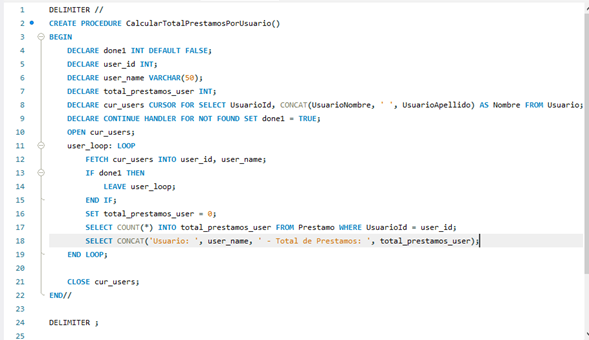
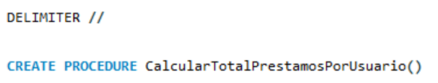
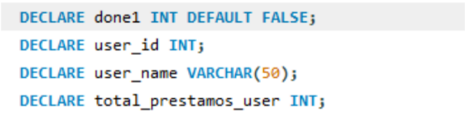
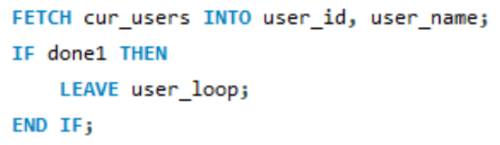
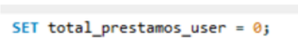
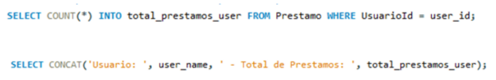
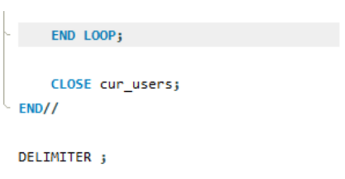
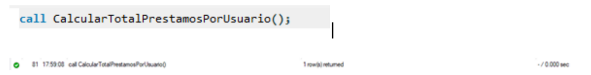
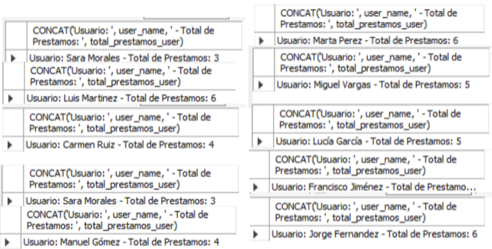

# Cursores en MySQL Workbench
#### Elaborado por Grupo 4 INF-272

En `MySQL`, a diferencia de Oracle, para manipular cursores es necesario `crear un procedimiento`, el cual será llamado más adelante para `ejecutar` dicho cursor. A continuación mostramos la `estructura` ideal para cursores explícitos, posteriormente mostraremos un ejemplo en `Workbench`.

## Estructura de Cursores Explícitos
  ```sql
-- Cambiamos el delimitador
DELIMITER $$

-- Definimos el procedimiento
CREATE PROCEDURE EjemploCursorExplicito()
BEGIN
    -- Declaración de variables
    DECLARE done BOOLEAN DEFAULT FALSE;
    DECLARE tempColumn1 INT;
    DECLARE tempColumn2 VARCHAR(255);

    -- Declaración del cursor
    DECLARE cursorTemp CURSOR FOR
        SELECT column1, column2 FROM MiTabla;

    -- Manejador de resultados no encontrados
    DECLARE CONTINUE HANDLER FOR NOT FOUND SET done = TRUE;

    -- Apertura del cursor
    OPEN cursorTemp;

    -- Recorrido de los resultados
    loopTemp: LOOP
        FETCH cursorTemp INTO tempColumn1, tempColumn2;
        
        IF done THEN
            LEAVE loopTemp;
        END IF;
        
        -- Procesamiento de los datos
        -- (Puedes realizar cualquier operación con los datos obtenidos)
    END LOOP;

    -- Cierre del cursor
    CLOSE cursorTemp;
END$$

-- Restauramos el delimitador predeterminado
DELIMITER ;

```
## Ejemplo de Cursor Explicito


1. **Usamos el delimitador:** La instrucción `DELIMITER` se utiliza para cambiar el delimitador de comandos en MySQL.


1. **Declaramos las variables:** `done1` es un indicador que nos ayuda a `controlar` si tenemos datos en el cursor.

1. **Declaramos el cursor:** para `recorrer` los usuarios.


1. **Manejador de resultados no encontrados:** `CONTINUE HANDLER` verifica si ya no existen más registros.


1. `Abrimos` el cursor.

1. `Recorremos` todos los usuarios devueltos por el `cursor`.

1. Obtenemos el `id` del usuario y su `nombre`.

1. Inicializamos el `total` de préstamos en `0`.

1. `Consultamos` para obtener el total de préstamos del usuario actual e `imprimimos` el `resultado`.

1.  `Terminamos` el loop, `cerramos `el cursor y `finalizamos` el procedimiento.

1.  `Ejecutamos` el procedimiento con el siguiente comando.

1.  Damos `click` para hacer correr el programa al icono de rayo que esta en el `panel superior`.

1.  `Corrida` del codigo.
