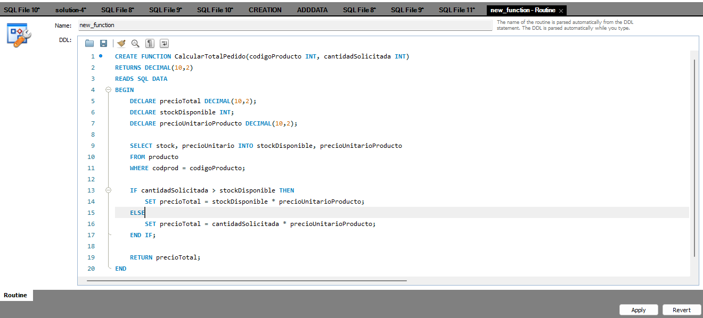
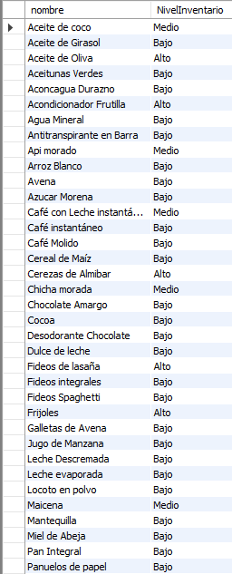

# Funciones Almacenadas en MySQL Workbench
#### Elaborado por Grupo 4 INF-272

## Introducción
Las funciones almacenadas en MySQL son rutinas programadas que están diseñadas para devolver un solo valor. Se emplean comúnmente para encapsular fórmulas o reglas de negocio habituales, lo que las hace altamente reutilizables en diversas declaraciones SQL o dentro de otros programas almacenados.

A diferencia de los procedimientos almacenados, las funciones almacenadas pueden utilizarse dentro de las sentencias SQL donde se requieran expresiones, mejorando así la legibilidad y mantenibilidad del código.

## Sintaxis: Creación de Funciones Almacenadas
Para crear una función almacenada, se utiliza la instrucción `CREATE FUNCTION`. La sintaxis básica para la creación de una nueva función almacenada se muestra a continuación:

```sql
CREATE FUNCTION nombre_funcion (lista_de_parametros) 
RETURNS tipo_de_retorno
[caracteristica1, caracteristica2, ...]
BEGIN
  -- Cuerpo de la función, incluyendo sentencias SQL y control de flujo.
END;
```

#### Elementos de la Sintaxis

1. **`CREATE FUNCTION nombre_funcion`**: Este es el comienzo de la declaración. `CREATE FUNCTION` indica a MySQL que se está creando una nueva función almacenada seguido del identificador único dentro de la base de datos que será `nombre_funcion`.

2. **`lista_de_parametros`**: Se define con el formato `parametro tipo`, donde `parametro` es el nombre del parámetro y `tipo` es el tipo de dato de MySQL que se espera. Los parámetros funcionan como variables locales que contienen los valores pasados a la función en el momento de su invocación. Por ejemplo: `(edad INT, salario DECIMAL(10,2))`.

3. **`RETURNS tipo_de_retorno`**: Determina el tipo de dato que la función devolverá. Este tipo de dato debe ser un tipo válido de MySQL y puede ser cualquier tipo escalar como INT, VARCHAR, DATE, entre otros.

4. **`[NOT] DETERMINISTIC`**: Especifica si la función proporcionará el mismo resultado para los mismos parámetros de entrada cada vez que se ejecute. `DETERMINISTIC` se utiliza cuando la función es determinista. Si no se especifica, o si se utiliza `NOT DETERMINISTIC`, MySQL asume que el resultado puede variar.

5. **`BEGIN ... END`**: Contiene el bloque de código de la función, donde se ejecutan las sentencias SQL. Este bloque puede incluir estructuras de control de flujo como IF, CASE, LOOP, entre otros.

6. **`RETURN`**: Dentro del bloque `BEGIN ... END`, se usa la instrucción `RETURN` para devolver el valor de la función. La ejecución de la función finaliza tan pronto como se ejecuta `RETURN`.


- **Modificadores de Parámetros**: A diferencia de los procedimientos almacenados, las funciones almacenadas solo admiten parámetros `IN`. Los parámetros `OUT` o `INOUT` no son válidos en el contexto de funciones.

- **Determinismo**: El atributo `DETERMINISTIC` es crucial en el contexto de la replicación y la optimización de consultas.  Una función es determinista si siempre retorna el mismo resultado dado un conjunto de parámetros de entrada idénticos en cualquier momento y bajo cualquier circunstancia. Por otro lado, una función es no determinista si puede retornar diferentes resultados con los mismos parámetros de entrada. Por ejemplo, una función que utiliza el valor actual del tiempo o que hace consultas que pueden devolver diferentes resultados con el tiempo es no determinista.

- **Manejo de Excepciones**: Las funciones almacenadas deben manejar adecuadamente cualquier excepción utilizando declaraciones de control de flujo como `DECLARE ... HANDLER`. Esta construcción permite definir acciones específicas cuando ocurren errores o condiciones determinadas durante la ejecución de la función. Los manejadores de excepciones se colocan dentro del cuerpo de la función, antes de las sentencias que podrían generar la excepción.

- **Seguridad de la Invocación**: `SQL SECURITY DEFINER` o `SQL SECURITY INVOKER` determina si la función se ejecutará con los privilegios del usuario que la creó o con los privilegios del usuario que la invoca.
- 
## Creación y Ejecución 
##### Creación
- **Abrir MySQL Workbench**: Iniciar sesión y conectar con la base de datos `supermarketbd`.
- **Nueva pestaña SQL**: Abrir una nueva pestaña para ejecutar consultas.
   

- **Escribir el procedimiento en la pestaña SQL**: Introducir el código del procedimiento en la nueva pestaña de consulta.

```sql 
DELIMITER $$

CREATE FUNCTION ObtenerNivelInventario(codigoProducto INT) 
RETURNS VARCHAR(10)
DETERMINISTIC
READS SQL DATA
BEGIN
    DECLARE nivelInventario VARCHAR(10);
    DECLARE cantidadEnStock INT;

    -- Seleccionamos la cantidad en stock del producto basado en su código
    SELECT stock INTO cantidadEnStock
    FROM producto
    WHERE codprod = codigoProducto;

    -- Clasificamos el nivel de inventario basado en la cantidad en stock
    IF cantidadEnStock > 100 THEN
        SET nivelInventario = 'Alto';
    ELSEIF cantidadEnStock BETWEEN 51 AND 100 THEN
        SET nivelInventario = 'Medio';
    ELSE
        SET nivelInventario = 'Bajo';
    END IF;

    -- Devolvemos el nivel de inventario
    RETURN nivelInventario;
END$$

DELIMITER ;
```


##### Ejecución
- **Ejecutar el Procedimiento**: Seleccionar todo el texto del procedimiento y ejecutarlo.
  
- **Verificar la Creación del Procedimiento**: Navegar al nodo de 'Procedimientos Almacenados' en el esquema de la base de datos y refrescar si es necesario para ver el nuevo procedimiento listado. Si no observa el procedimiento almacenado, puede hacer clic en el botón Actualizar:
    

También es posible listar todas las funciones almacenadas de la base de datos actual utilizando el comando:

```sql
SHOW FUNCTION STATUS WHERE Db = 'nombre_de_la_base';
```


## Creación de Funciones Almacenadas desde la interfaz de MySQL Workbench

#### Paso 1: Conectar a la Base de Datos
Antes de comenzar, debemos asegurarnos de estar conectados a la base de datos en MySQL Workbench. Si aún no se ha establecido una conexión, debemos configurarla ingresando detalles como el nombre del servidor, el puerto, el usuario y la contraseña.

#### Paso 2: Acceder al Editor de Funciones
1. **Navegar al Esquema de la Base de Datos**: En el panel lateral de MySQL Workbench, localizamos y expandimos el esquema de la base de datos `supermarketbd`.


2. **Abrir el Menú de Funciones**: Hacemos clic derecho en "Functions" y seleccionamos la opción "Create Function".
 

#### Paso 3: Crear Nueva Función
1. **Usar el Asistente de Creación**:
   - Se abrirá un nuevo editor de funciones
   
- Definimos el nombre de la función, los parámetros y el cuerpo de la función.
   

#### Paso 4: Guardar y Compilar la Función
1. **Guardar la Función**:
   - Hacemos clic en el botón "Apply" en la parte inferior del editor para abrir el diálogo de revisión del script SQL.
   - Revisamos el código SQL que MySQL Workbench ha generado para asegurarnos de que todo esté correcto.
   
2. **Ejecutar el Script**:
   - Hacemos clic en "Apply" en el diálogo de revisión para ejecutar el script en la base de datos.
   - Si todo está correcto, recibiremos una notificación de que la función se ha creado exitosamente.
    

#### Paso 5: Verificar y Probar la Función
1. **Verificar la Función en la Lista**:
   - Regresamos al panel de funciones almacenadas en `supermarketbd` para confirmar que tu nueva función aparece listada. Refrescar la lista si es necesario.
     
1. **Probar la Función**:
   - En el editor de consultas SQL y probamos la función utilizando una sentencia como:
     ```sql
     SELECT CalcularTotalPedido(26, 20) AS TotalPedido;
     ```
    

## Invocación de Funciones Almacenadas en Sentencias SQL

Las funciones almacenadas en MySQL, una vez definidas, pueden ser invocadas dentro de las sentencias SQL para realizar operaciones y devolver valores que son el resultado de la lógica encapsulada en dichas funciones. Estas se pueden utilizar en cualquier lugar donde las expresiones son permitidas dentro de las consultas SQL, como parte de la lista de selección, condiciones de filtros (`WHERE`), o en la cláusula `ORDER BY`, entre otros.

#### Sintaxis de Invocación Estándar
La sintaxis general para invocar una función almacenada en una sentencia SQL es la siguiente:

```sql
SELECT 
    columna1, 
    columna2, 
    ..., 
    NombreFuncionAlmacenada(argumentos) AS AliasResultado
FROM
    NombreTabla
WHERE 
    CondicionesFiltro
ORDER BY 
    ColumnaOrdenamiento;
```

Donde:

- **`columna1, columna2, ...,`**: Representan las columnas seleccionadas de la tabla.
- **`NombreFuncionAlmacenada(argumentos)`**: Es la invocación de la función almacenada con los argumentos necesarios que la función requiere.
- **`AS AliasResultado`**: Es un alias para el resultado retornado por la función, proporcionando un nombre descriptivo que se mostrará en los resultados de la consulta.
- **`NombreTabla`**: Es el nombre de la tabla de donde se están extrayendo los datos.
- **`CondicionesFiltro`**: Son las condiciones bajo las cuales se filtrarán los registros para la consulta.
- **`ColumnaOrdenamiento`**: Es la columna por la cual se ordenarán los resultados de la consulta.

#### Ejemplo

Suponiendo que existe una función `ObtenerNivelInventario` que toma como argumento el stock actual de un producto y devuelve una clasificación basada en la cantidad, la sintaxis para invocar esta función sería:

```sql
SELECT 
    nombre, 
    ObtenerNivelInventario(stock) AS NivelInventario
FROM
    producto
ORDER BY 
    nombre;
```



## Eliminación de Funciones Almacenadas en (MySQL DROP FUNCTION)

La sentencia `DROP FUNCTION` se utiliza para eliminar una función almacenada en la base de datos. La sintaxis general para la eliminación de una función almacenada es:

```sql
DROP FUNCTION [IF EXISTS] nombre_funcion;
```

- **`nombre_funcion`**: Es el identificador de la función almacenada que se desea eliminar.
- **`DROP FUNCTION`**: Es el comando utilizado para eliminar una función almacenada.
- **`[IF EXISTS]`**: Es una cláusula opcional que se puede incluir para evitar errores en caso de que la función especificada no exista en el esquema de la base de datos. Si se omite esta cláusula y la función no existe, se generará un error.

### Ejemplo de Uso de `DROP FUNCTION`
Para ilustrar cómo eliminar una función almacenada, consideremos un ejemplo donde primero creamos una función llamada `TiempoDeEntregaPedido` que calcula el número de días entre la fecha de pedido y la fecha requerida:

```sql
DELIMITER $$

CREATE FUNCTION TiempoDeEntregaPedido(
    fechaPedido DATE,
    fechaRequerida DATE
) 
RETURNS INT
DETERMINISTIC
BEGIN
    RETURN DATEDIFF(fechaRequerida, fechaPedido);
END$$

DELIMITER ;
```


En segundo lugar, utilizamos la sentencia `DROP FUNCTION` para eliminar la función `TiempoDeEntregaPedido`:

```sql
DROP FUNCTION TiempoDeEntregaPedido;
```


Si intentamos eliminar una función que no existe, podemos hacer uso de la cláusula `IF EXISTS` para prevenir errores:

```sql
DROP FUNCTION IF EXISTS FuncionInexistente;
```


MySQL emitirá una advertencia si se intenta eliminar una función que no existe:

```
0 row(s) affected, 1 warning(s): 1305 FUNCTION esquema.FuncionInexistente does not exist
```

Si se desea ver la advertencia en detalle, se utiliza la declaración `SHOW WARNINGS`:

```sql
SHOW WARNINGS;
```


#### Elimianción desde la Interfaz de MySQL Workbench
Para eliminar una función en MySQL Workbench, puede localizar la función deseada en el Navegador de Esquemas. Haga clic derecho sobre el nombre de la función y seleccione la opción `Drop Function` del menú contextual. Esto eliminará la función de la base de datos.


## Listado de Funciones Almacenadas en MySQL 
#### Utilizando `SHOW FUNCTION STATUS`

La sintaxis para utilizar `SHOW FUNCTION STATUS` es la siguiente:

```sql
SHOW FUNCTION STATUS 
[LIKE 'patrón' | WHERE condición_de_búsqueda];
```

Este comando despliega las propiedades de las funciones almacenadas en la base de datos.

#### Ejemplos de Uso de `SHOW FUNCTION STATUS`

Para mostrar todas las funciones almacenadas en el servidor de MySQL actual:

```sql
SHOW FUNCTION STATUS;
```

```sql
SHOW FUNCTION STATUS 
WHERE Db = 'supermarketbd';
```


Si se necesita buscar funciones que contengan una palabra específica en su nombre, como "inventario", el comando sería:

```sql
SHOW FUNCTION STATUS 
LIKE '%inventario%';
```


#### Listado de Funciones Usando el Diccionario de Datos

El diccionario de datos es una fuente detallada de información sobre todas las rutinas almacenadas en el servidor MySQL. Es posible ejecutar una consulta en la tabla `INFORMATION_SCHEMA.ROUTINES` para obtener una lista de todas las funciones almacenadas en una base de datos específica.

#### Ejemplo de Consulta al Diccionario de Datos

Para encontrar todas las funciones almacenadas en la base de datos:

```sql
SELECT 
    ROUTINE_NAME
FROM
    INFORMATION_SCHEMA.ROUTINES
WHERE
    ROUTINE_TYPE = 'FUNCTION'
    AND ROUTINE_SCHEMA = 'supermarketbd';
```

Esta consulta te proporcionará los nombres de todas las funciones que están definidas dentro de la base de datos `supermarketbd`.


#### Visualización de Funciones en MySQL Workbench

Para usuarios de MySQL Workbench, la visualización de las funciones almacenadas se simplifica a través de la interfaz gráfica:

1. Conectarse a la base de datos.
   
2. Navegar al menú "Functions" en el panel de navegación a la izquierda.

Se mostrará una lista de todas las funciones pertenecientes a la base de datos, permitiendo una gestión fácil de las mismas.


