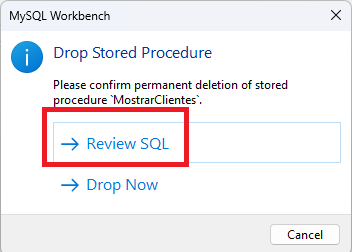
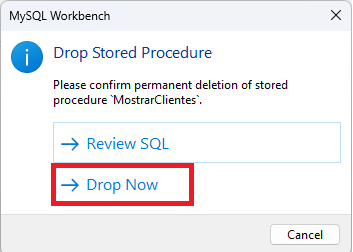

# Procedimientos Almacenados en MySQL Workbench
#### Elaborado por Grupo 4 INF-272

## Introducción
Los procedimientos almacenados en MySQL son conjuntos de sentencias SQL que se almacenan en el servidor de base de datos. Permiten ejecutar operaciones complejas, reutilizables y optimizar la carga de trabajo del servidor al reducir el tráfico de la red y centralizar la lógica de negocio.

## Sintaxis: Creación de Procedimientos Almacenadas
La creación de procedimientos almacenados en MySQL se realiza a través de la sentencia `CREATE PROCEDURE`. A continuación se describe la sintaxis básica:

```sql
CREATE PROCEDURE nombre_procedimiento(lista_parametros)
BEGIN
    secuencia_de_instrucciones;
END;
```

##### Elementos de la Sintaxis:
1. **`nombre_procedimiento`**: Es el identificador del procedimiento almacenado y se define inmediatamente después de `CREATE PROCEDURE`.
2. **`lista_parametros`**: Entre paréntesis, se listan los parámetros que acepta el procedimiento. Los parámetros pueden ser de tipo `IN`, `OUT`, o `INOUT`. Si no hay parámetros, se utilizan paréntesis vacíos `()`.
3. **`secuencia_de_instrucciones`**: El cuerpo del procedimiento almacenado que contiene una o más sentencias SQL válidas encerradas entre `BEGIN` y `END`.

### Prevención de Errores de Duplicidad
Para evitar errores al intentar crear un procedimiento que ya existe, se puede utilizar la cláusula `IF NOT EXISTS`:

```sql
CREATE PROCEDURE [IF NOT EXISTS] nombre_procedimiento (lista_parametros)
BEGIN
    secuencia_de_instrucciones;
END;
```
Esta cláusula permite que MySQL emita una advertencia en lugar de un error si el procedimiento ya existe. Disponible desde MySQL 8.0.29.

## Uso del Delimitador en MySQL

Cuando definimos un procedimiento almacenado en MySQL, que consiste en múltiples sentencias SQL, es necesario que el cliente de MySQL (como MySQL Workbench o la consola de mysql) trate al conjunto de sentencias como una única instrucción. Esto se debe a que el delimitador predeterminado, el punto y coma (`;`), indica el final de cada sentencia SQL. Sin embargo, para que el cliente de MySQL reconozca el procedimiento almacenado como una sola declaración, debemos cambiar temporalmente el delimitador.

#### Cambio del Delimitador
Para cambiar el delimitador predeterminado, utilizamos el comando `DELIMITER` de la siguiente manera:

```sql
DELIMITER caracter_delimitador
```

El `caracter_delimitador` puede consistir en un único carácter o en múltiples caracteres, como `//` o `$$`. Sin embargo, debemos evitar usar la barra invertida (`\`) porque es el carácter de escape en MySQL.

MySQL usa la barra invertida como carácter de escape, lo que permite incluir caracteres especiales dentro de las cadenas sin provocar errores de sintaxis. Por ejemplo, podemos usar el carácter de escape para incluir una comilla simple en una cadena de esta manera: `SELECT 'It\'s a sunny day';`

#### Ejemplo
El siguiente ejemplo ilustra cómo cambiar el delimitador actual a `//`:

```sql
DELIMITER //
```

Después de cambiar el delimitador, podemos usar el nuevo delimitador para terminar una sentencia, de la siguiente manera:

```sql
SELECT * FROM clientes // SELECT * FROM productos //
```

#### Restablecimiento al Delimitador Predeterminado
Para volver al delimitador predeterminado, que es el punto y coma (`;`), utilizamos la siguiente sentencia:

```sql
DELIMITER ;
```

### Pasos para la definición de un Procedimiento Almacenado

1. **Cambio de Delimitador**: Antes de definir el procedimiento, cambiamos el delimitador para evitar conflictos con el punto y coma (;) utilizado en las sentencias SQL internas.
2. **Definición del Procedimiento**: Usamos `CREATE PROCEDURE` para definir el procedimiento.
3. **Restauración del Delimitador**: Después de definir el procedimiento, restauramos el delimitador a su valor predeterminado.

#### Ejemplo de Uso: Creación de un Procedimiento Almacenado 
Crearemos un procedimiento almacenado en `supermarketbd` para obtener un informe de los productos por categoría, incluyendo detalles como el nombre del producto, precio, stock y la categoría a la que pertenecen. Además, queremos que este procedimiento permita filtrar por un mínimo de stock disponible, que será pasado como parámetro.

#### Ejemplo: Sintaxis definición de Procedimientos Almacenados

1. **Cambio del Delimitador**: Antes de comenzar, es necesario cambiar el delimitador para facilitar la inclusión de múltiples sentencias SQL dentro del procedimiento sin conflictos de sintaxis.

   ```sql
   DELIMITER $$
   ```

2. **Creación del Procedimiento Almacenado**: Definimos el procedimiento `InformeProductosPorCategoria` que acepta dos parámetros: el nombre de la categoría y el mínimo de stock requerido.

   ```sql
   CREATE PROCEDURE InformeProductosPorCategoria(IN categoriaNombre VARCHAR(100), IN stockMinimo INT)
   BEGIN
       SELECT 
           p.nombre AS Producto,
           p.precio AS Precio,
           p.stock AS Stock,
           c.nombre AS Categoria
       FROM
           productos p
           JOIN categorias c ON p.id_categoria = c.id
       WHERE
           c.nombre = categoriaNombre AND
           p.stock >= stockMinimo
       ORDER BY
           p.precio DESC;
   END $$
   ```

   - **`categoriaNombre` y `stockMinimo`**: Parámetros de entrada que permiten especificar la categoría de productos y el mínimo de stock requerido.
   - **`JOIN`**: Utilizamos una unión entre las tablas `productos` y `categorias` para obtener el nombre de la categoría asociada a cada producto.
   - **`WHERE`**: Filtramos los productos que pertenecen a la categoría especificada y que tienen un stock igual o superior al mínimo requerido.

3. **Restauración del Delimitador**: Una vez definido el procedimiento, restablecemos el delimitador a su valor predeterminado.

   ```sql
   DELIMITER ;
   ```

## Creación y Ejecución de Procedimietos Almacenamientos

##### Creación
- **Abrir MySQL Workbench**: Iniciar sesión y conectar con la base de datos `supermarketbd`.
2. **Nueva Pestaña SQL**: Abrir una nueva pestaña para ejecutar consultas.

- **Escribir el Procedimiento en la Pestaña SQL**: Introducir el código del procedimiento en la nueva pestaña de consulta.


##### Ejecución
- **Ejecutar el Procedimiento**: Seleccionar todo el texto del procedimiento y ejecutarlo.
  
- **Verificar la Creación del Procedimiento**: Navegar al nodo de 'Procedimientos Almacenados' en el esquema de la base de datos y refrescar si es necesario para ver el nuevo procedimiento listado. Si no observa el procedimiento almacenado, puede hacer clic en el botón Actualizar:


## Creación de Procedimientos Almacenados Utilizando el Asistente de MySQL Workbench
MySQL Workbench ofrece un asistente integrado que simplifica la creación de procedimientos almacenados. Este asistente maneja automáticamente los detalles, como la definición de delimitadores, y facilita la ejecución de comandos para crear procedimientos almacenados.

### Pasos para Crear un Procedimiento Almacenado

1. **Acceder al Asistente de Procedimientos Almacenados**:
   - Navegamos hasta el panel 'Navigator' de MySQL Workbench.
  
   - Hacemos click derecho en la sección 'Stored Procedures'.
   - Seleccionamos la opción 'Create Stored Procedure...' del menú contextual.
    
   Se abrirá una nueva pestaña en MySQL Workbench que te permite definir el nuevo procedimiento almacenado.
   

2. **Definir el Nombre y Cuerpo del Procedimiento Almacenado**:
   - En el campo proporcionado, cambiamos `new_procedure` por el el nombre del procedimiento almacenado.
   - Entre los bloques `BEGIN...END`, agregamos el código SQL que representa la lógica del procedimiento.
  

3. **Aplicar los Cambios**:
   - Una vez que hayamos escrito el código del procedimiento, hacemos clic en el botón 'Apply'.
  
   - MySQL Workbench mostrará una nueva ventana donde podremos revisar el script SQL del procedimiento antes de aplicarlo a la base de datos.
  

4. **Confirmar la Creación del Procedimiento**:
   - Hacemos clic nuevamente en 'Apply' para confirmar y crear el procedimiento almacenado en el servidor de MySQL.
  
   - Una vez completado el proceso, observaremos un mensaje de confirmación.
  

5. **Finalizar el Proceso**:
   - Hacemos clic en el botón 'Finish' para cerrar la ventana de confirmación.

6. **Verificar el Procedimiento Almacenado**:
   - Regresamos a la lista de procedimientos almacenados en la sección 'Stored Procedures' para confirmar que el nuevo procedimiento se ha añadido correctamente.
   - Si es necesario, refrescar la lista para ver el procedimiento recién creado.
  


## Ejecución del Procedimiento Almacenado
Para invocar un procedimiento almacenado usamos la sentencia `call`.

```sql
CALL InformeProductosPorCategoria('Lácteos', 50);
CALL ListarProveedoresPorCiudad('La Paz');
```


Este comando ejecuta el procedimiento almacenado, que es equivalente a realizar una consulta directa para obtener todos los productos del la tabla.


## Eliminación de Procedimientos Almacenados en MySQL


La sentencia `DROP PROCEDURE` se emplea para eliminar un procedimiento almacenado, previamente definido con la sentencia `CREATE PROCEDURE`. Esta operación es irreversible y debe realizarse con precaución.

#### Sintaxis de `DROP PROCEDURE`
La sintaxis completa para eliminar un procedimiento almacenado es:

```sql
DROP PROCEDURE [IF EXISTS] nombre_procedimiento;
```

##### Elementos de la Sintaxis:
1. **`nombre_procedimiento`**: Identificador único del procedimiento almacenado que se desea eliminar.
2. **`IF EXISTS`**: Cláusula condicional que evita que se genere un error en caso de que el procedimiento especificado no exista en el esquema actual.

### Privilegios y Control de Acceso
Para ejecutar la sentencia `DROP PROCEDURE`, se debe poseer el privilegio `ALTER ROUTINE`. Este privilegio permite a un usuario modificar o eliminar procedimientos almacenados que el mismo usuario haya creado o para los cuales tenga los derechos explícitos.

#### Obtención del Privilegio `ALTER ROUTINE`
El privilegio `ALTER ROUTINE` se concede generalmente por un administrador de base de datos o un usuario con privilegios elevados mediante la sentencia `GRANT`, como se muestra a continuación:

```sql
GRANT ALTER ROUTINE ON `nombre_bd`.* TO 'usuario'@'host';
```

En este comando, `nombre_bd` representa la base de datos donde reside el procedimiento y `usuario`@`host` designa la cuenta de usuario y el host desde donde se conectará.


##### Ejemplo: Eliminación Directa de un Procedimiento Almacenado
Supongamos que existe un procedimiento almacenado llamado `ListarCategorias` en `supermarketbd`. Para eliminarlo directamente, utilizaríamos:

```sql
DROP PROCEDURE ListarCategorias;
```

Si el procedimiento `ListarCategorias` no existe, MySQL generará un error indicando su ausencia.

##### Ejemplo: Eliminación Condicional con `IF EXISTS`
Para evitar errores al intentar eliminar procedimientos que pueden no existir, empleamos `IF EXISTS`:

```sql
DROP PROCEDURE IF EXISTS ProcedimientoNoDefinido;
```

Utilizar `IF EXISTS` cambia el error por una advertencia, la cual puede ser consultada con `SHOW WARNINGS`.


### Eliminación de Procedimientos Almacenados Mediante Interfaz de MySQL Workbench

1. **Selección del Procedimiento**: Localizar el procedimiento almacenado en la lista de procedimientos del esquema correspondiente.


2. **Ejecución de la Eliminación**: Hacer clic derecho sobre el procedimiento y elige la opción "Drop Stored Procedure" o "Eliminar Procedimiento Almacenado".


3. **Confirmación y Revisión**: Se mostrarpa un mensaje de confirmación la opción `Review SQL` permite revisar el comando SQL generado antes de ejecutarlo. 
   


La opción `Drop Now` eliminará el procedimeinto de forma inmediata.




## Modificación de Procedimientos con `ALTER PROCEDURE`

La declaración `ALTER PROCEDURE` en MySQL constituye un recurso fundamental para gestionar y modificar procedimientos almacenados en bases de datos. Su utilidad radica en la capacidad de efectuar ajustes controlados en las características y comportamientos de los procedimientos almacenados existentes, sin necesidad de eliminarlos por completo y recrearlos desde cero. En esta sección, se profundizará en el uso y la sintaxis de la declaración ALTER PROCEDURE.

## Sintaxis y Uso Básico de `ALTER PROCEDURE`

La sintaxis básica de la declaración `ALTER PROCEDURE` es la siguiente:

```sql
ALTER PROCEDURE nombre_procedimiento [característica ...]
```

Donde:

- `nombre_procedimiento`: Corresponde al nombre del procedimiento almacenado que se desea modificar.
- `[característica ...]`: Representa las características específicas que se pretenden modificar en el procedimiento almacenado.

Las características susceptibles de modificación incluyen:

- `COMMENT 'cadena'`: Permite añadir un comentario descriptivo al procedimiento almacenado.
- `LANGUAGE SQL`: Define el lenguaje en el que está redactado el procedimiento almacenado (generalmente SQL).
- `{ CONTAINS SQL | NO SQL | READS SQL DATA | MODIFIES SQL DATA }`: Especifica si el procedimiento almacenado contiene consultas SQL, no contiene SQL o solamente lee/modifica datos.
- `SQL SECURITY { DEFINER | INVOKER }`: Establece si el procedimiento se ejecuta con los privilegios del definer (quien lo creó) o del invoker (quien lo llama).

## Limitaciones y Procedimientos de Modificación

Es esencial tener en cuenta que la declaración ALTER PROCEDURE no permite alterar la estructura interna del procedimiento almacenado, como agregar o eliminar parámetros, o modificar su lógica interna. Para efectuar cambios significativos en la estructura o el comportamiento del procedimiento almacenado, se sugiere seguir estos pasos:

1. Eliminar el procedimiento almacenado existente mediante la declaración DROP PROCEDURE.
2. Crear un nuevo procedimiento almacenado con los cambios deseados utilizando la declaración CREATE PROCEDURE.

#### Ejemplo 
En primer lugar, procederemos a crear el procedimiento `MostrarClientes`, el cual nos permitirá visualizar la información de los clientes en nuestra base de datos. 


A continuación, agregaremos un comentario descriptivo al procedimiento recién creado. Este comentario nos ayudará a entender rápidamente la función del procedimiento en futuras consultas. El comando SQL para agregar el comentario es el siguiente:

```sql
ALTER PROCEDURE MostrarClientes COMMENT "Mostrar Clientes";
```


Luego de haber añadido el comentario, es esencial verificar que se haya aplicado correctamente al procedimiento. Para hacer esto, ejecutaremos el siguiente comando SQL para mostrar la definición completa del procedimiento almacenado, incluyendo el comentario agregado:

```sql
SHOW CREATE PROCEDURE MostrarClientes;
```

Finalmente, revisaremos la definición del procedimiento almacenado para confirmar si el comentario ha sido añadido de manera exitosa. Esta revisión nos permitirá asegurarnos de que el procedimiento esté debidamente documentado y listo para su uso:


El resultado obtenido indicará si hemos agregado el comentario de manera exitosa al procedimiento `MostrarClientes`. Esta verificación es crucial para garantizar la comprensión y el mantenimiento eficiente de nuestros procedimientos almacenados en la base de datos.

## Modificación de Procedimientos Almacenados utilizando MySQL Workbench

1. **Acceso al Procedimiento Almacenado:** En primer lugar, realizamos clic derecho sobre el procedimiento almacenado que deseamos modificar y seleccionamos la opción "Alter Stored Procedure" (Modificar Procedimiento Almacenado) en el menú contextual.
   

2. **Definición del Procedimiento Almacenado:** MySQL Workbench abrirá una nueva pestaña que contiene la definición completa del procedimiento almacenado seleccionado. Esto incluye la estructura, las consultas SQL y cualquier comentario asociado al procedimiento.
   

3. **Realización de Cambios:** Realizamos los cambios necesarios en la definición del procedimiento almacenado directamente en la pestaña abierta. Estos cambios pueden incluir modificaciones en la lógica de las consultas, la adición o eliminación de parámetros, entre otros ajustes.
   

4. **Revisión del Script SQL:** Después de realizar los cambios, MySQL Workbench presenta una ventana de revisión del script SQL. En esta ventana, podemos verificar las modificaciones realizadas y asegurarnos de que el script refleje los cambios planeados de manera precisa.
   

5. **Implementación de las Modificaciones:** MySQL Workbench utiliza una secuencia de declaraciones DROP PROCEDURE y CREATE PROCEDURE para implementar las modificaciones en el procedimiento almacenado. Al hacer clic en el botón "Apply" (Aplicar), el script SQL generado se ejecuta para aplicar las modificaciones al procedimiento almacenado en la base de datos.
   

6. **Confirmación de la Ejecución:** Una vez que se ha ejecutado el script SQL, MySQL Workbench muestra una ventana que indica el estado de la ejecución del script. Es importante revisar esta ventana para confirmar que las modificaciones se han aplicado correctamente y que no ha habido errores durante el proceso de modificación.
   

7. **Finalización del Proceso:** Finalmente, hacemos clic en el botón "Finish" (Finalizar) para completar el proceso de modificación del procedimiento almacenado. Esto garantiza que los cambios realizados sean efectivos y estén disponibles para su uso en la base de datos.


## Listado de Procedimientos Almacenados 
La sintaxis básica para el comando `SHOW PROCEDURE STATUS` es:

```sql
Copy code
SHOW PROCEDURE STATUS [LIKE 'patrón' | WHERE condición_de_búsqueda];
```
Este comando muestra todas las características de los procedimientos almacenados, incluyendo los nombres de dichos procedimientos. Solo devuelve los procedimientos a los que tienes privilegios de acceso.

Por ejemplo, para mostrar todos los procedimientos almacenados en el servidor MySQL actual:

```sql
SHOW PROCEDURE STATUS;
```


#### Filtrado de Procedimientos Almacenados
Si deseamos mostrar procedimientos almacenados en una base de datos específica, podemos utilizar una cláusula `WHERE` con el comando `SHOW PROCEDURE` STATUS, como en el siguiente ejemplo:

```sql
SHOW PROCEDURE STATUS 
WHERE condición_de_búsqueda;
```

Por ejemplo, para listar todos los procedimientos almacenados en la base de datos `supermarketbd`:


```sql
SHOW PROCEDURE STATUS 
WHERE Db = 'supermarketbd';
```


En el caso de que necesitemos encontrar procedimientos almacenados cuyos nombres contengan una palabra específica, podemos usar la cláusula `LIKE`:

```sql
SHOW PROCEDURE STATUS 
LIKE '%palabra_clave%';
```

Por ejemplo, para mostrar todos los procedimientos almacenados cuyos nombres contengan la palabra `"Proveedor"`:

```sql
SHOW PROCEDURE STATUS 
LIKE '%Proveedor%';
```


#### Uso del Diccionario de Datos para Listar Procedimientos
La tabla routines en la base de datos information_schema contiene información sobre todos los procedimientos almacenados y funciones de todas las bases de datos en el servidor MySQL actual.

Para mostrar todos los procedimientos almacenados de una base de datos en particular, utilizaremos la siguiente consulta:

```sql
SELECT 
    ROUTINE_NAME
FROM
    INFORMATION_SCHEMA.ROUTINES
WHERE
    ROUTINE_TYPE = 'PROCEDURE'
    AND ROUTINE_SCHEMA = 'supermarketbd';
```


## Visualización de Procedimientos Almacenados en MySQL Workbench
En MySQL Workbench, podemos visualizar todos los procedimientos almacenados de una base de datos accediendo a la base de datos que deseamos revisar para ver los procedimientos almacenados.
Abrir el menú de 'Stored Procedures' (Procedimientos Almacenados). Veremos una lista de los procedimientos almacenados que pertenecen a la base de datos actual.

