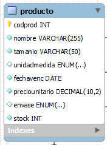
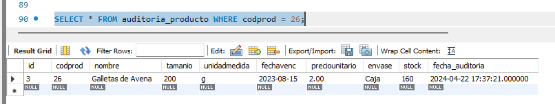
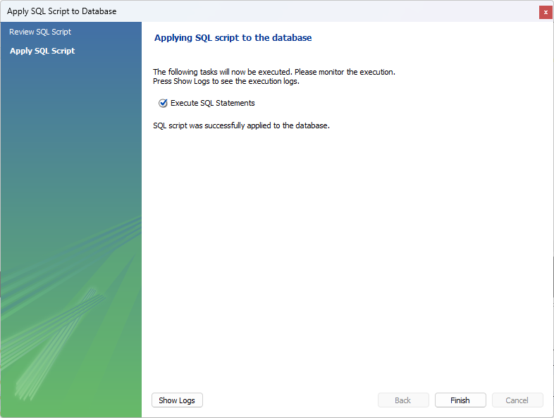

# Triggers en MySQL Workbench
#### Elaborado por Grupo 4 INF-272

## Definición y Tipos de Triggers en MySQL

Un disparador, conocido como *trigger*, es un procedimiento definido que se asocia directamente con una tabla dentro de una base de datos MySQL. Se activa automáticamente para ejecutar una acción preestablecida en respuesta a ciertos eventos que afectan a dicha tabla. Estos eventos incluyen operaciones de inserción (INSERT), actualización (UPDATE) o eliminación (DELETE) de datos. 

Es importante destacar que para crear y ejecutar triggers se requieren privilegios de SUPERUSUARIO o root en la cuenta que realiza estas operaciones, garantizando así un nivel adecuado de control y seguridad en la gestión de la base de datos.

### Clasificación de los Triggers

Los triggers en MySQL se categorizan principalmente en dos tipos:

1. **Triggers de Nivel de Fila (Row Level Triggers):** Se activan de manera individual para cada operación de inserción, actualización o eliminación realizada en las filas de una tabla. Esto significa que si una instrucción afecta a múltiples filas, el trigger se ejecutará una vez por cada fila afectada.

2. **Triggers de Nivel de Sentencia (Statement Level Triggers):** Son invocados una única vez por cada ejecución de una instrucción, independientemente de cuántas filas se vean afectadas por dicha instrucción. Este tipo de triggers es común en sistemas de gestión de bases de datos como Oracle o PL/SQL.

MySQL, a partir de su versión 8.0, se enfoca exclusivamente en el soporte de triggers de nivel de fila, los cuales proporcionan una granularidad fina al responder específicamente a los cambios realizados en cada registro individual de la tabla.

## Sintaxis para la creación de Triggers en MySQL

```sql
CREATE TRIGGER nombre_del_trigger
momento_de_activacion
evento_activador
ON nombre_tabla FOR EACH ROW
[orden_del_trigger]
cuerpo_del_trigger
```

- `nombre_del_trigger`: Es el identificador único del trigger dentro de una tabla. Debe ser distintivo y describir la función o el momento del trigger para evitar confusiones.

- `momento_de_activacion`: Se especifica mediante las palabras clave `BEFORE` (antes) o `AFTER` (después), lo que determina si el trigger se activará antes o después del evento que lo dispara.

- `evento_activador`: Corresponde al tipo de acción que desencadena la ejecución del trigger. Los valores permitidos para este campo son:

  - `INSERT`: Se activa para cada inserción de fila.
  - `UPDATE`: Se activa para cada modificación de fila, es decir, actualizaciones de filas utilizando sentencias `UPDATE`.
  - `DELETE`: Se activa cuando una fila se elimina de la tabla.

- `nombre_tabla`: Es el nombre de la tabla de MySQL para la cual se está definiendo el trigger.

- `orden_del_trigger`: Este es un campo opcional que se utiliza para definir el orden de ejecución del trigger, especialmente cuando hay múltiples triggers asociados con el mismo evento. La sintaxis para especificar el orden es `{FOLLOWS | PRECEDES} otro_trigger`, indicando si el trigger actual debe seguir o preceder a otro trigger específico.

**Nota:** Si el `cuerpo_del_trigger` contiene múltiples declaraciones, se debe utilizar una sintaxis similar a la empleada en la creación de un PROCEDIMIENTO ALMACENADO (`STORED PROCEDURE`). En tal caso, el cuerpo del trigger se encerraría entre los comandos `BEGIN` y `END`, y toda la definición del trigger se situaría entre comandos `DELIMITER` para permitir múltiples declaraciones especificadas con bloques `BEGIN…END`.

##### Ejemplo de la definición de un trigger con múltiples declaraciones:

```sql
DELIMITER $$
CREATE TRIGGER nombre_del_trigger
momento_de_activacion
evento_activador
ON nombre_tabla FOR EACH ROW
BEGIN
    -- Aquí van las sentencias SQL que se ejecutarán
END $$
DELIMITER ;
```

## Aplicaciones prácticas de los Triggers en MySQL

### Verificación de integridad de datos y manejo de errores

El uso de triggers `BEFORE` permite realizar comprobaciones de integridad en los valores de las columnas antes de que se efectúen inserciones o actualizaciones. Por ejemplo, si deseamos asegurarnos de que el precio de un `producto` esté dentro de un rango específico antes de insertar o actualizar la fila, podríamos hacer algo así:

```sql
CREATE TRIGGER VerificarPrecio
BEFORE INSERT ON producto
FOR EACH ROW
BEGIN
  IF NEW.precio < 0 OR NEW.precio > 1000 THEN
    SIGNAL SQLSTATE '45000'
    SET MESSAGE_TEXT = 'El precio del producto debe estar entre 0 y 1000.';
  END IF;
END;
```

### Creación de Entradas de Registro de Cambios (Changelog)

Los triggers son útiles para crear registros de auditoría. Por ejemplo, si queremos rastrear todas las actualizaciones en la tabla `producto`, podríamos crear un trigger `AFTER UPDATE` que inserte un registro en una tabla de auditoría:

```sql
CREATE TRIGGER RegistroCambioProducto
AFTER UPDATE ON producto
FOR EACH ROW
BEGIN
  INSERT INTO producto_auditoria(codprod, nombre, precio, fecha_modificacion)
  VALUES (OLD.codprod, OLD.nombre, OLD.precio, NOW());
END;
```

### Derivar o Actualizar Campos Adicionales

Puede ser necesario actualizar una o más columnas como respuesta a una actualización o inserción original. Por ejemplo, podríamos querer actualizar el campo `stock` en la tabla `producto` cada vez que se realiza una inserción:

```sql
CREATE TRIGGER ActualizarStock
AFTER INSERT ON compra
FOR EACH ROW
BEGIN
  UPDATE producto
  SET stock = stock + NEW.cantidad
  WHERE codprod = NEW.codprod;
END;
```

### Replicar Datos en Diferentes Tablas

En ocasiones, queremos insertar o actualizar datos en otras tablas como resultado de una inserción o actualización en una tabla diferente. En estos casos, se pueden definir triggers para realizar estas actualizaciones cruzadas de datos.

#### Datos de Prueba y Creación de Triggers en MySQL

Con el fin de probar los triggers, primero se debe tener una tabla en la cual actuarán. Tomemos como ejemplo la creación de la tabla `producto` de la base de datos `supemarketbd`:

```sql
CREATE TABLE PRODUCTO (
    codprod INT NOT NULL AUTO_INCREMENT,
    nombre VARCHAR(255) NOT NULL,
    tamanio VARCHAR(50) NOT NULL,
    unidadmedida ENUM('g', 'kg', 'ml', 'l', 'pack') NOT NULL,
    fechavenc DATE,
    preciounitario DECIMAL(10,2) NOT NULL,
    envase ENUM('TetraPack', 'Botella', 'Bolsa', 'Caja') NOT NULL,
    stock INT NOT NULL CHECK (stock >= 0),
    PRIMARY KEY (codprod)
);

```


## Creación de Triggers en MySQL
Consideraremos la tabla de productos de la base de datos `supermarketbd` y establecer una tabla de auditoría para registrar estas acciones.


#### Configuración de la Tabla de Auditoría

Primero, necesitamos establecer una tabla de auditoría que registre las inserciones en la tabla de productos. Esta tabla de auditoría capturará detalles específicos de cada producto al momento de su inserción.

```sql
CREATE TABLE auditoria_producto (
  id INT NOT NULL AUTO_INCREMENT PRIMARY KEY,
  codprod INT,
  nombre VARCHAR(255),
  tamanio VARCHAR(50),
  unidadmedida ENUM('g', 'kg', 'ml', 'l', 'pack'),
  fechavenc DATE,
  preciounitario DECIMAL(10,2),
  envase ENUM('TetraPack', 'Botella', 'Bolsa', 'Caja'),
  stock INT,
  fecha_auditoria DATETIME(6)
);
```


### Triggers de Inserción (INSERT TRIGGERS)

En MySQL, los triggers de inserción se pueden clasificar en dos tipos: `AFTER INSERT` y `BEFORE INSERT`.

#### Trigger Después de la Inserción (AFTER INSERT)

Este trigger se ejecutará después de que se inserte un registro en la tabla de productos, añadiendo un registro correspondiente en la tabla de auditoría.

```sql
DELIMITER $$
CREATE TRIGGER trigger_despues_insertar_producto
AFTER INSERT ON producto
FOR EACH ROW
BEGIN
  INSERT INTO auditoria_producto(codprod, nombre, tamanio, unidadmedida, fechavenc, preciounitario, envase, stock, fecha_auditoria) VALUES (NEW.codprod, NEW.nombre, NEW.tamanio, NEW.unidadmedida, NEW.fechavenc, NEW.preciounitario, NEW.envase, NEW.stock, NOW());
END$$
DELIMITER ;
```

Este trigger garantiza que cada nuevo producto insertado en la tabla `producto` sea registrado en `auditoria_producto` con todos los detalles relevantes y la fecha y hora de la inserción.

Podemos verificar la correcta creación del trigger accediendo a la carpeta de triggers en la tabla correspondiente en MySQL Workbench. 


Procedamos a probar la funcionalidad de los triggers que hemos establecido. Realizaremos una inserción en la tabla `producto` para observar cómo actúan los triggers de inserción.

```sql
INSERT INTO producto(nombre, precio, stock) VALUES("Detergente Henko", 150.50, 100);
```


Después de ejecutar esta inserción, podemos verificar si el registro correspondiente en la tabla `auditoria_producto` ha sido creado como resultado de la activación del trigger `AFTER INSERT`. Para ello, ejecutamos la siguiente consulta:

```sql
SELECT * FROM auditoria_producto;
```


Esta consulta nos permitirá ver si se ha registrado adecuadamente la nueva entrada en la tabla de auditoría, reflejando todos los detalles del producto que acabamos de insertar, incluyendo la fecha y hora exactas de la inserción.

### Trigger Antes de Insertar (BEFORE INSERT)

Los triggers `BEFORE INSERT` se ejecutan antes de cada inserción de fila en la tabla objetivo. Este tipo de trigger permite la modificación de los valores que van a ser insertados, asegurando que los datos cumplan con ciertas condiciones o reglas antes de ser oficialmente registrados en la base de datos.

La sintaxis para la creación de un trigger `BEFORE INSERT` se mantiene igual que la que se observó en la sección anterior. Este consiste en especificar el momento de la activación (`BEFORE`), el evento que lo desencadena (`INSERT`), y la tabla objetivo, seguido de la cláusula `FOR EACH ROW` que indica que el trigger debe ejecutarse individualmente para cada fila afectada por la inserción.

El uso de un trigger `BEFORE INSERT` es especialmente útil cuando se desea modificar los valores que están siendo insertados a otros valores por defecto o según ciertas reglas de negocio. Por ejemplo, se puede ajustar automáticamente un precio si excede un límite máximo establecido o se puede normalizar la información textual antes de que se guarde en la base de datos.

#### Creación del Trigger `BEFORE INSERT`

Este trigger diseñando para la tabla `producto`, ajusta el `preciounitario` en un 2% si este es mayor a 100, antes de la inserción del registro:

```sql
DELIMITER $$
CREATE TRIGGER trigger_antes_insertar_producto
BEFORE INSERT ON producto
FOR EACH ROW
BEGIN
  IF NEW.preciounitario > 100 THEN
    SET NEW.preciounitario = NEW.preciounitario * 1.02;  -- Aumenta el precio en un 2%
  END IF;
END$$
DELIMITER ;
```


Este trigger ajusta el `preciounitario` del producto que está siendo insertado, asegurando que si el precio supera los 100, automáticamente se incremente en un 2%.

#### Ejemplo de Uso

Para probar este trigger, realizaremos la inserción de un registro en la tabla `producto` y luego verificaremos que el trigger ha modificado los datos como se espera:

```sql
INSERT INTO producto(nombre, tamanio, unidadmedida, fechavenc, preciounitario, envase, stock) VALUES("Salsa de Tomate", "1", "l", '2025-01-01', 120, 'Botella', 50);
```


Este comando intentará insertar un nuevo producto con un precio inicial de 120. Dado que el precio es mayor a 100, el trigger `BEFORE INSERT` debería incrementar este precio en un 2%, modificándolo a 122.4 antes de que el registro sea insertado en la tabla.

#### Verificación de la Inserción

Para verificar si el trigger ha funcionado correctamente, podemos ejecutar una consulta que recupere el registro recién insertado y revisar el `preciounitario`:

```sql
SELECT * FROM producto WHERE nombre = "Salsa de Tomate";
```


Esta consulta mostrará el registro de "Salsa de Tomate", incluyendo el precio unitario ajustado, confirmando que el trigger ha operado correctamente antes de la inserción del producto en la base de datos.

## Update Trigger
En MySQL, los triggers de actualización (`UPDATE TRIGGERS`) se utilizan para ejecutar acciones automáticamente antes o después de que se actualice una fila en una tabla existente. Estos triggers se clasifican en dos tipos principales: `BEFORE UPDATE` y `AFTER UPDATE`. A continuación, adaptaremos ejemplos de ambos tipos para la tabla `producto` de tu base de datos, incorporando aspectos técnicos más formales y detallados.

### Trigger Antes de la Actualización (`BEFORE UPDATE`)

Este tipo de trigger se ejecuta antes de que se aplique la actualización en la base de datos, lo que permite modificar los valores de las nuevas filas (`NEW`) basándose en los valores antiguos (`OLD`). Por ejemplo, ajustaremos el stock del producto solo si la nueva cantidad es menor que la cantidad anterior:

```sql
DELIMITER $$
CREATE TRIGGER trigger_antes_actualizar_producto
BEFORE UPDATE ON producto
FOR EACH ROW
BEGIN
    IF OLD.stock > NEW.stock THEN
        SET NEW.stock = OLD.stock - NEW.stock;
    ELSE
        SET NEW.stock = 0;
    END IF;
END $$
DELIMITER ;
```


Este trigger garantiza que la actualización del campo `stock` refleje la diferencia entre el valor antiguo y el nuevo, siempre que el nuevo stock sea menor que el antiguo.

### Trigger Después de la Actualización (`AFTER UPDATE`)

El trigger `AFTER UPDATE` se ejecuta después de que la actualización se ha realizado en la base de datos. Este tipo de trigger es útil para registrar cambios en una tabla de auditoría. Crearemos un trigger que inserte una fila en la tabla de auditoría `auditoria_producto` con los valores actualizados:

```sql
DELIMITER $$
CREATE TRIGGER trigger_despues_actualizar_producto
AFTER UPDATE ON producto
FOR EACH ROW
BEGIN
    INSERT INTO auditoria_producto(codprod, nombre, tamanio, unidadmedida, fechavenc, preciounitario, envase, stock, fecha_auditoria)
    VALUES (OLD.codprod, OLD.nombre, OLD.tamanio, OLD.unidadmedida, OLD.fechavenc, OLD.preciounitario, OLD.envase, NEW.stock, NOW());
END $$
DELIMITER ;
```


Este trigger captura los cambios realizados en un producto específico y registra estos cambios en la tabla de auditoría con el momento exacto en que ocurrió la actualización.

#### Ejemplo 

Supongamos que queremos actualizar el stock de un producto en la base de datos. Realizamos la siguiente actualización:

```sql
UPDATE producto SET stock = 20 WHERE codprod = 26;
```


Esta actualización disparará el trigger `BEFORE UPDATE`, que ajustará el stock según la lógica definida, y luego el trigger `AFTER UPDATE` registrará esta modificación en la tabla de auditoría.

Para verificar los resultados y entender la secuencia de ejecución de los triggers, podemos consultar la tabla de auditoría:

```sql
SELECT * FROM auditoria_producto WHERE codprod = 26;
```

Este comando mostrará cómo los triggers han registrado cada paso de la actualización, proporcionando una trazabilidad completa del proceso de modificación del stock del producto.


## Creación de Triggers Utilizando el Asistente GUI de MySQL Workbench

Al igual que con la creación mediante el evento `CREATE TRIGGER` en la línea de comandos, los triggers también pueden ser creados utilizando clientes GUI de MySQL, como MySQL Workbench. A continuación, se describen los pasos para crear un trigger `BEFORE INSERT` utilizando la GUI de MySQL Workbench.

#### Paso 1: Seleccionar la Tabla

Hacemos clic derecho sobre el nombre de la tabla donde necesitamos crear el trigger, en este caso, podríamos considerar una tabla como `producto`.


#### Paso 2: Modificar la Tabla

Seleccionamos la opción "Alter Table" (Modificar Tabla) para abrir la interfaz de configuración de la tabla.


#### Paso 3: Acceder a la Pestaña de Triggers

Navegamos a la pestaña "Triggers" en la ventana de configuración de la tabla.


1. **Table Name:** Es donde se muestra el nombre de la tabla a la que le quieres agregar el trigger, en este caso, `cliente`.

2. **Charset/Collation:** Indica el conjunto de caracteres y la collation para la tabla, que en este caso es `utf8mb4_0900_ai_ci`. Esta configuración determina cómo se interpretan y comparan los caracteres.

3. **Comments:** Aquí podemos añadir comentarios relacionados con la tabla, lo cual puede ser útil para documentar el propósito de la tabla o cualquier otra nota relevante.

4. **Trigger Sections:** En la parte inferior, observamos una serie de opciones para los distintos tipos de triggers que puedes crear: `BEFORE INSERT`, `AFTER INSERT`, `BEFORE UPDATE`, `AFTER UPDATE`, `BEFORE DELETE`, y `AFTER DELETE`. Estos representan los distintos eventos en los que un trigger puede ejecutarse.

5. **Crear un Nuevo Trigger**: Para comenzar la creación de un nuevo trigger, hacemos clic en el signo ‘+’ junto a la sección del evento de trigger deseado. Por ejemplo, para crear un trigger que se ejecute antes de la inserción de datos, ubicamos la sección "BEFORE INSERT".

6. **Definición del Trigger**: En el panel derecho, aparecerá un editor de texto donde podremos definir la lógica del trigger. Aquí es donde escribiremos la lógica del trigger


7. **Aplicar Cambios**: Una vez que hayamos terminado de definir la lógica del trigger, hacemos clic en “Apply” para guardar los cambios. Se mostrará un resumen del script SQL que se ejecutará para crear el trigger.


8. **Confirmación y Verificación**: Después de hacer clic en "Apply", MySQL Workbench ejecutará el script SQL. Para verificar que el trigger se ha creado correctamente, puedes utilizar el comando `SHOW TRIGGERS` en la consola de MySQL Workbench, o simplemente buscar el trigger en la lista de triggers de la tabla dentro de la interfaz gráfica de Workbench.



